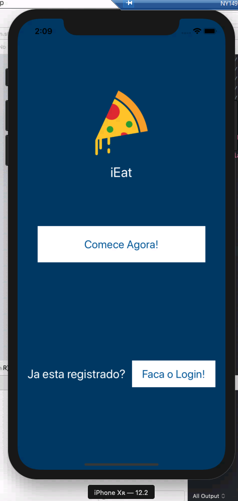

# iEat
> Tenha controle sobre a sua dieta!

[![Swift Version][swift-image]][swift-url]
[![Build Status][travis-image]][travis-url]
[![License][license-image]][license-url]

  

Use o aplicativo para saber quantas calorias voce pode consumir no seu dia.  
E também controle o seu peso e a quantidade de calorias dos seus alimentos.

Marvel Link - https://marvelapp.com/8ifi31b/screen/57354842

## Funcionalidades

- Mostrar calorias diarias
- Escolha de alimentos

## Requisitos

- iOS 8.0+
- Xcode 7.3

## Meta

Lucas Rodrigues - 14.00556-5

[https://github.com/lucasrodrigues10](https://github.com/dbader/)

[swift-image]:https://img.shields.io/badge/swift-4.0-orange.svg
[swift-url]: https://swift.org/
[license-image]: https://img.shields.io/badge/License-MIT-blue.svg
[license-url]: LICENSE
[travis-image]: https://img.shields.io/travis/dbader/node-datadog-metrics/master.svg?style=flat-square
[travis-url]: https://travis-ci.org/dbader/node-datadog-metrics
[codebeat-image]: https://codebeat.co/badges/c19b47ea-2f9d-45df-8458-b2d952fe9dad
[codebeat-url]: https://codebeat.co/projects/github-com-vsouza-awesomeios-com
