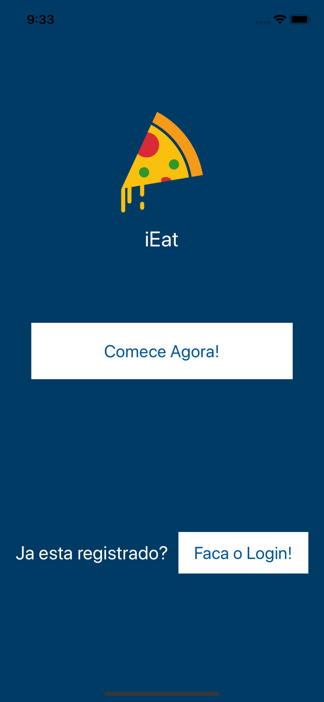
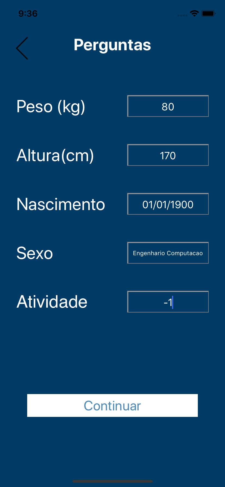
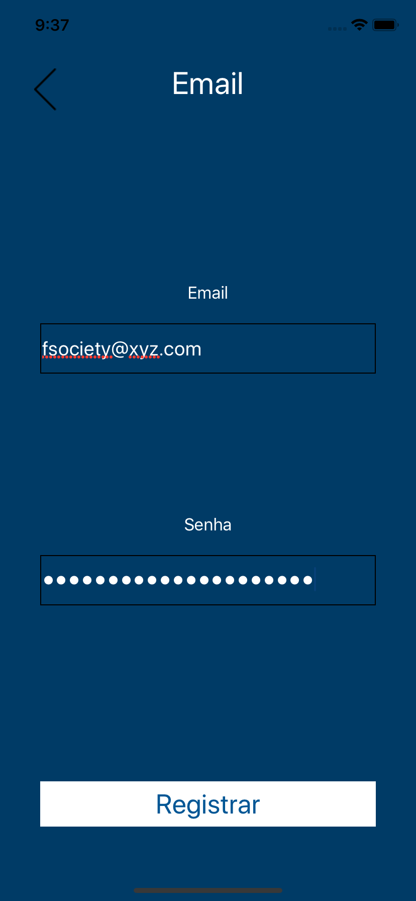
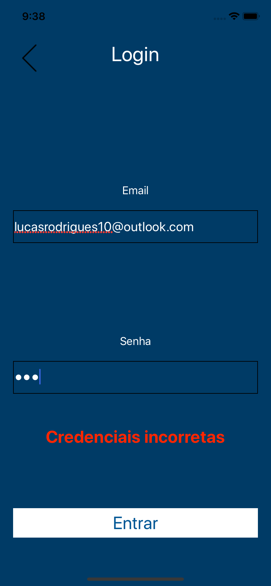
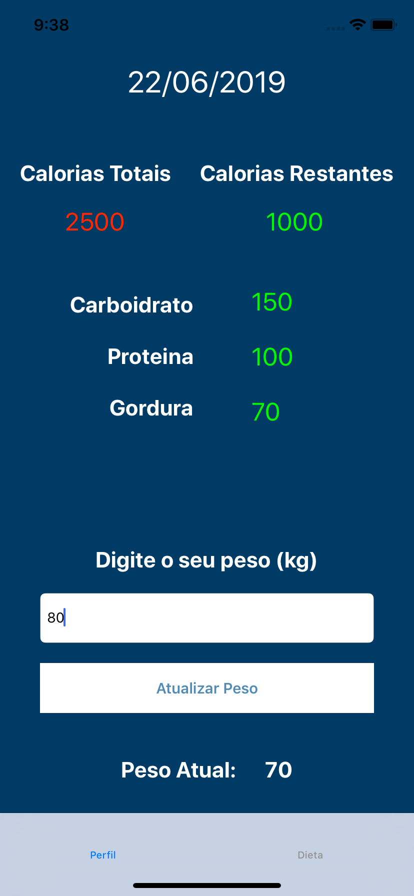
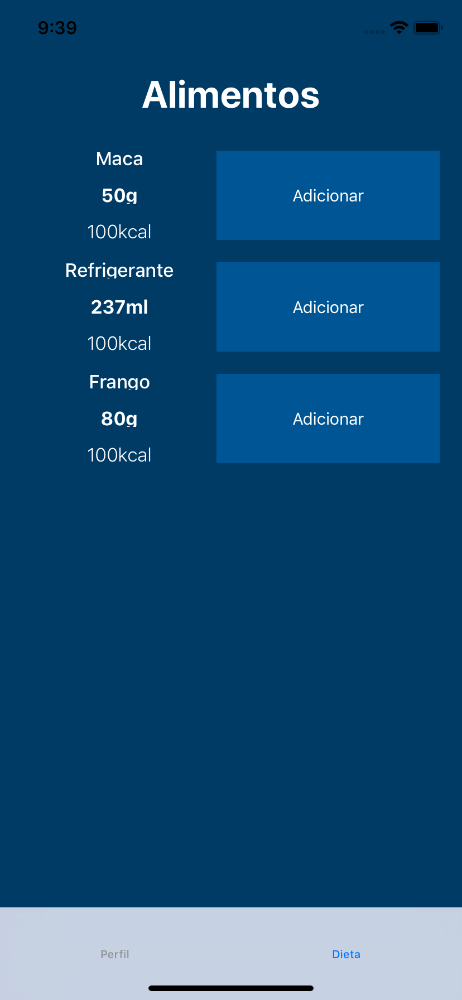

# iEat
> Tenha controle sobre a sua dieta!

[![Swift Version][swift-image]][swift-url]
[![Build Status][travis-image]][travis-url]
[![License][license-image]][license-url]

  

Use o aplicativo para saber quantas calorias voce pode consumir no seu dia.  
E também controle o seu peso e a quantidade de calorias dos seus alimentos.

# Como usar?

 
  
  
  

Nessa secao voce pode clicar em <b>Comecar Agora</b> para realizar o registro.  
Responda as perguntas para identificar o seu perfil energetico.  
Digite o seu email e senha para fazer o login futuramente.  

 
  
  
  

Faca o login utilizando o seu e-mail e senha, caso digite alguma informacao incorreta um aviso em vermelho aparecera.   
No aba <b>Perfil</b> ha a informacao de <b>Calorias Totais</b> que voce pode consumir em um dia.  
  Alem de quantas calorias voce ja consumiu, <b> Calorias Restantes</b> e seus respectivos nutrientes (Carboidratos, Proteinas e Gorduras).  
E tambem voce pode atualizar o seu peso para saber se a sua dieta esta surtindo efeito, seja para aumento ou diminuicao de massa corporal.  
Na aba <b>Dieta</b> voce pode ver os alimentos e os nutrientes de cada uma deles e adicionar na sua alimentacao diaria.

Marvel Link - https://marvelapp.com/8ifi31b/screen/57354842

## Funcionalidades

- Mostrar a energia (<i>calorias</i>) necessária para manter o peso
- Mostrar a energia (<i>calorias</i>) consumida
- Controle da massa corporal (<i>peso</i>)
- Mostrar informacoes nutricionais dos alimentos

## Requisitos

- iOS 8.0+
- Xcode 7.3

## Licenca

Projeto criado para o curso de desenvolvimento de aplicativos para o sistema operacional iOS no Instituto Maua de Tecnologia lecionado por Murilo Zanini. 

## Autor

Lucas Rodrigues - 14.00556-5

[https://github.com/lucasrodrigues10](https://github.com/dbader/)

[swift-image]:https://img.shields.io/badge/swift-4.0-orange.svg
[swift-url]: https://swift.org/
[license-image]: https://img.shields.io/badge/License-MIT-blue.svg
[license-url]: LICENSE
[travis-image]: https://img.shields.io/travis/dbader/node-datadog-metrics/master.svg?style=flat-square
[travis-url]: https://travis-ci.org/dbader/node-datadog-metrics
[codebeat-image]: https://codebeat.co/badges/c19b47ea-2f9d-45df-8458-b2d952fe9dad
[codebeat-url]: https://codebeat.co/projects/github-com-vsouza-awesomeios-com

## Inspiracao

  

